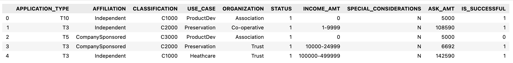
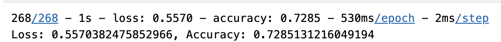
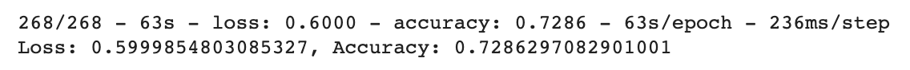

# Deep Learning Challenge 
## Background 
The nonprofit foundation Alphabet Soup wants a tool that can help it select the applicants for funding with the best chance of success in their ventures. With your knowledge of machine learning and neural networks, you’ll use the features in the provided dataset to create a binary classifier that can predict whether applicants will be successful if funded by Alphabet Soup.

From Alphabet Soup’s business team, you have received a CSV containing more than 34,000 organizations that have received funding from Alphabet Soup over the years. Within this dataset are a number of columns that capture metadata about each organization, such as:
* EIN and NAME — Identification columns
* APPLICATION_TYPE — Alphabet Soup application type
* AFFILIATION — Affiliated sector of industry
* CLASSIFICATION — Government organization classification
* USE_CASE — Use case for funding
* ORGANIZATION — Organization type
* STATUS — Active status
* INCOME_AMT — Income classification
* SPECIAL_CONSIDERATIONS — Special considerations for application
* ASK_AMT — Funding amount requested
* IS_SUCCESSFUL — Was the money used effectively

## Report 
### Overview of the analysis 
The purpose of this analysis was to see if I could create a binary classifier that could accurately predict whether an applicant will be successful if funded by Alphabet Soup.

### Results 
### Data Preprocessing 
* What variable(s) are the target(s) for your model? 
  - The target variable was the "IS_SUCCESSFUL" column.
 
* What variable(s) are the features for your model?
  - The features of the model are the remaining columns after dropping the "IS_SUCCESSFUL" column: APPLICATION_TYPE,  AFFILIATION, CLASSIFICATION, USE_CASE, ORGANIZATION, STATUS, INCOME_AMT, SPECIAL_CONSIDERATIONS, ASK_AMT. However, the model further split the INCOME_AMT and APPLICATION_TYPE when I used pd.get_dummies.

* What variable(s) should be removed from the input data because they are neither targets nor features? 
  - The "EIN" and "NAME" columns were removed. These are strictly for identification and wouldn't help the model.

### Compiling, Training, and Evaluating the Model 
* How many neurons, layers, and activation functions did you select for your neural network model, and why?
  - In the inital model, I used 2 layers, relu, and sigmoid. I kept the activation functions the same in the optimized version but increased the hidden layers to 4 hoping it would increase the accuracy. 
 
* Were you able to achieve the target model performance?
  - Unfortunately, I wasn't able to achieve the target model performance. My loss actually increased. 
 
* What steps did you take in your attempts to increase model performance?
  - To increase the model performance, I made 7 changes. I droppped the SPECIAL_CONSIDERATIONS and STATUS columns. I binned the organization values. I added two more hidden layers, changed the input dims to 39, and adjusted the hidden layer units. I also increased the epochs to 200. 
  
### Summary 
* The inital model had a loss of 55.7% and accuracy of 72.9%.

* The optimized model had a loss of 60% and accuracy of 72.9%.

* The accuracy remained the same but there was almost 5% more loss so the optimized model didn't perform better. There are a few things that could be done to increase the performance of the model. More data could be used in training. Even longer epochs could be used. The data could be processed in a different way, perhaps binning other features that I did not. In additon, a different algorithm that is better suited could also be used. You could use decision trees. Better yet, random forests since it can handle more features. 
